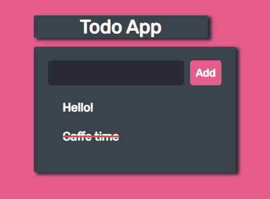

# Js-Simple-Todo
I'm **learning** some dev stuff so I thought it'll be kinda good to start with this little todo.

## Usage:
     Enter the task name, press the "Add" button,
     To mark a task as completed, simply click on it,
     To delete an entry, double-click.
### Enjoy!

